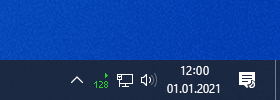

# Trayscout
This lightweight Nightscout client for Windows will display your latest blood glucose value and trend in the system tray. If you click on the icon, a blood glucose diagram will be shown. Multiple styles/schemes are supported to better fit into your artificial pancreas system.

A simple INI file is used for configuration:
- BaseUrl = URL of your Nightscout instance
- APISecret = API secret of your Nightscout instance
- UpdateInterval = Blood glucose update interval in minutes
- High = Upper limit of your normal range (for example 200 or 11.1)
- Low = Lower limit of your normal range (for example 80 or 4.4)
- Unit = Unit to be used (mgdl or mmolL, without /)
- UseColor = Whether to use different colors based on blood glucose value instead of white
- UseAlarm = Whether to play an alarm sound when out of normal range (to use, place your custom Alarm.mp3 in the Trayscout folder)
- AlarmInterval = Alarm interval in minutes
- Style = Diagram style to be used (xDrip, AndroidAPS, Dexcom or Light)
- TimeRange = Time range of diagram in hours (maximum is 6)
- Width = Width of diagram in pixel
- Height = Height of diagram in pixel
- FontFamily = Font family used for axis labels
- FontSize = Font size used for axis labels

How to use:
- Extract the Trayscout.zip into a folder of your choice
- Open Config.ini in Notepad > Set at least BaseUrl and APISecret > Save and close
- Run Trayscout.exe, now you should see your blood glucose value in the system tray
  - If not, an error window should pop up and tell you what's wrong

Always display tray icon:
- Right click on taskbar > Taskbar settings > Notification area > Select which icons appear on the taskbar
- Enable Trayscout

Run on startup:
- Right click on Trayscout.exe > Create shortcut > Cut (CTRL+X)
- Windows + R > shell:startup > Enter > Paste (CTRL+V)