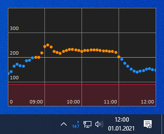

# Trayscout
This lightweigt Nightscout client for Windows is written in C# and will display your latest blood glucose value in the system tray.

A simple INI file, which can be edited using Notepad for example, is used for configuration:
- BaseUrl = URL of your Nightscout instance
- APISecret = API secret of your Nightscout instance
- UpdateInterval = Blood glucose update interval in minutes
- High = Upper limit of your normal range
- Low = Lower limit of your normal range
- UseColor = Wether to use different colors for the blood glucose value instead of white
- UseAlarm = Wether to play an alarm sound when out of normal range
- AlarmInterval = Alarm interval in minutes

If you like, you can change the font/color and the alarm sound by editing or replacing the corresponding files.